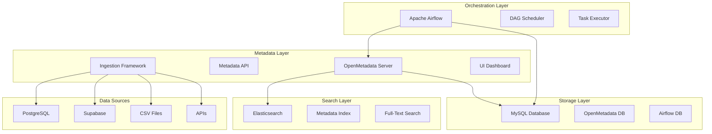
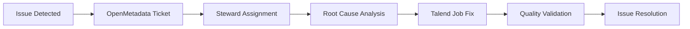

# Data Governance Platform with OpenMetadata & Airflow

## 📋 Project Overview

A modern data governance and orchestration platform built on OpenMetadata and Apache Airflow. This solution provides comprehensive metadata management, data cataloging, lineage tracking, and workflow orchestration capabilities for enterprise data operations.

### 🎯 Key Capabilities
- **Metadata Management**: Centralized catalog for all data assets using OpenMetadata
- **Data Lineage**: Track data flow and transformations across your data ecosystem
- **Workflow Orchestration**: Automated ETL/ELT pipelines with Apache Airflow
- **Data Quality**: Built-in data quality checks and monitoring
- **Search & Discovery**: Full-text search across all metadata
- **Governance**: Policy management and data classification

## 🏗️ System Architecture

### High-Level Architecture


### Technology Stack
| Component | Technology | Version | Purpose |
|-----------|------------|---------|---------|  
| **Metadata Catalog** | OpenMetadata | 1.10.5 | Data cataloging, lineage, governance |
| **Workflow Engine** | Apache Airflow | 2.x | ETL/ELT orchestration |
| **Metadata Storage** | MySQL | 8.x | Persistent metadata storage |
| **Search Engine** | Elasticsearch | 8.11.4 | Full-text metadata search |
| **Containerization** | Docker Compose | 3.9 | Service orchestration |
| **Python Libraries** | pandas, psycopg2, faker | Latest | Data processing |## 🚀 Quick Start

### Prerequisites
- Docker and Docker Compose (v20.10+)
- 8GB RAM minimum
- 20GB free disk space
- Git

### Installation Steps

#### 1. Clone Repository
```bash
git clone https://github.com/Hamza-Bouali/Data-Gov.git
cd Data-Gov/docker-setup
```

#### 2. Start All Services
```bash
# Start the complete stack
docker compose up -d

# Verify all services are healthy
docker compose ps
```

#### 3. Wait for Services to Initialize
```bash
# Check service logs
docker compose logs -f openmetadata-server

# Services typically take 2-3 minutes to fully start
```

#### 4. Access the Platform
- **OpenMetadata UI**: http://localhost:8585
  - Default credentials: `admin` / `admin`
- **Airflow UI**: http://localhost:8080
  - Default credentials: `admin` / `admin`  
- **Elasticsearch**: http://localhost:9200
- **MySQL**: `localhost:3306`

### Quick Validation
```bash
# Check OpenMetadata health
curl http://localhost:8585/api/v1/health

# Check Airflow health  
curl http://localhost:8080/health

# View running services
docker compose ps
```

## 📊 Master Data Domains

### Core Data Entities

| Domain | French Label | Key Attributes | Owner |
|--------|--------------|----------------|-------|
| **Clients** | Clients | client_code, raison_sociale, siret, adresse | Sales Director |
| **Suppliers** | Fournisseurs | supplier_code, nom, categorie, conditions_paiement | Procurement Manager |
| **Products** | Produits/Articles | sku, description, poids, dimensions, prix | Product Manager |
| **Sites** | Sites/Entrepôts | site_code, adresse, capacite, type | Operations Manager |
| **Vehicles** | Véhicules/Chauffeurs | immatriculation, capacite, type, chauffeur | Fleet Manager |

### Database Schema
```sql
-- Example: Clients Master Table
CREATE TABLE mdm_clients (
    golden_id SERIAL PRIMARY KEY,
    client_code VARCHAR(50) UNIQUE NOT NULL,
    raison_sociale VARCHAR(255) NOT NULL,
    siret VARCHAR(14),
    adresse TEXT,
    ville VARCHAR(100),
    code_postal VARCHAR(10),
    pays VARCHAR(100) DEFAULT 'France',
    contact_principal VARCHAR(100),
    email VARCHAR(150),
    telephone VARCHAR(20),
    segment_client VARCHAR(50),
    statut VARCHAR(20) DEFAULT 'actif',
    
    -- Data Quality Metrics
    dq_score INTEGER DEFAULT 100,
    dq_issues JSONB,
    last_validated TIMESTAMP,
    
    -- Audit Fields
    created_by VARCHAR(100),
    created_at TIMESTAMP DEFAULT NOW(),
    updated_at TIMESTAMP DEFAULT NOW(),
    source_system VARCHAR(50)
);
```

## 🔧 Configuration

### Directory Structure
```
Data-Gov/
├── docker-setup/
│   ├── docker-compose.yml          # Main service configuration
│   ├── openmetadata.env            # OpenMetadata environment variables
│   ├── requirements.txt            # Python dependencies for Airflow
│   ├── dags/                       # Airflow DAGs directory
│   │   ├── mdm_master_data_etl.py  # Master data ETL pipeline
│   │   ├── example_dag.py          # Example DAG
│   │   └── [OpenMetadata DAGs]     # Auto-generated ingestion DAGs
│   ├── plugins/                    # Airflow plugins (custom operators)
│   ├── openmetadata-config/        # OpenMetadata configuration backup
│   │   ├── README.md               # Configuration documentation
│   │   └── .gitkeep                # Track directory in git
│   └── docker-volume/              # Persistent data (excluded from git)
│       └── db-data/                # MySQL data files
├── database/                       # Database initialization scripts
│   └── init-scripts/
│       ├── 01-mdm-schema.sql       # Schema definitions
│       └── 02-sample-data.sql      # Sample data
├── scripts/                        # Utility scripts
│   ├── start-environment.sh       # Start all services
│   └── stop-environment.sh        # Stop all services  
├── .gitignore                      # Git ignore rules
├── README.md                       # This file
└── LICENSE                         # License information
```

### OpenMetadata Configuration

All OpenMetadata settings are stored in `docker-setup/openmetadata.env`:

```env
# Cluster Configuration
OPENMETADATA_CLUSTER_NAME=openmetadata
SERVER_PORT=8585
SERVER_ADMIN_PORT=8586

# Database Configuration  
DB_USER=openmetadata_user
DB_USER_PASSWORD=openmetadata_password
DB_HOST=mysql
DB_PORT=3306

# Authentication (default: basic auth)
AUTHENTICATION_PROVIDER=basic
AUTHENTICATION_ENABLE_SELF_SIGNUP=true
```

See `docker-setup/openmetadata.env` for complete configuration.

### Airflow Configuration

Airflow is configured via environment variables in `docker-compose.yml`:

```yaml
environment:
  AIRFLOW__CORE__EXECUTOR: LocalExecutor
  AIRFLOW__API__AUTH_BACKENDS: "airflow.api.auth.backend.basic_auth"
  DB_HOST: mysql
  AIRFLOW_DB: airflow_db
```

**Adding Python Dependencies:**

Edit `docker-setup/requirements.txt` and restart the ingestion service:
```bash
# Add your package to requirements.txt
echo "your-package==version" >> requirements.txt

# Restart to install new packages
docker compose restart ingestion
```

### Network Configuration

All services run on a custom bridge network:
- Network: `app_net`
- Subnet: `172.16.240.0/24`
- Services communicate via internal DNS names

## 📈 Data Quality Framework

### Quality Dimensions Monitored

| Dimension | Metrics | Threshold |
|-----------|---------|-----------|
| **Completeness** | Required fields populated | > 95% |
| **Validity** | Data format compliance | > 98% |
| **Uniqueness** | No duplicate golden records | 100% |
| **Consistency** | Cross-domain referential integrity | > 99% |
| **Timeliness** | Data freshness < 24h | > 90% |

### Quality Dashboard
```sql
-- Data Quality Summary View
CREATE VIEW dq_summary AS
SELECT 
    'clients' as domain,
    COUNT(*) as total_records,
    AVG(dq_score) as avg_quality,
    COUNT(CASE WHEN dq_score < 80 THEN 1 END) as poor_quality_count
FROM mdm_clients
UNION ALL
SELECT 'fournisseurs', COUNT(*), AVG(dq_score), 
       COUNT(CASE WHEN dq_score < 80 THEN 1 END) 
FROM mdm_fournisseurs;
```

## 🔍 Data Governance

### Roles & Responsibilities

| Role | Responsibilities | Tools Access |
|------|------------------|--------------|
| **Data Steward** | Data quality monitoring, Issue resolution | OpenMetadata, Talend |
| **Data Owner** | Domain governance, Policy approval | OpenMetadata |
| **Data Consumer** | Data usage, Requirement definition | PostgreSQL, Reports |
| **MDM Admin** | System maintenance, User management | All tools |

### Governance Processes

#### 1. Data Issue Management


#### 2. Change Management
- **Standard Changes**: Data quality rule updates
- **Normal Changes**: New master data domains
- **Major Changes**: Schema modifications, Tool upgrades

## 🛠️ Operations & Maintenance

### Daily Operations
```bash
# Check system status
./scripts/health_check.sh

# Run manual MDM processing
./scripts/run_mdm_pipeline.sh

# Verify data quality
./scripts/check_data_quality.sh
```

### Monitoring & Alerts

#### Key Metrics to Monitor
- **System Health**: Service availability, Disk space
- **Data Quality**: DQ scores, Validation failures
- **Processing**: Job success rates, Processing time
- **Governance**: Policy violations, Unclassified data

#### Alert Configuration
```bash
# Example alert script
#!/bin/bash
DQ_SCORE=$(psql -U mdm_user -d mdm_hub -t -c "SELECT AVG(dq_score) FROM mdm_clients")

if (( $(echo "$DQ_SCORE < 80" | bc -l) )); then
    echo "ALERT: Low data quality score: $DQ_SCORE" | mail -s "MDM Quality Alert" admin@company.com
fi
```

### Backup Strategy
```bash
# Daily database backup
0 1 * * * pg_dump -U mdm_user mdm_hub > /backups/mdm_hub_$(date +%Y%m%d).sql

# Weekly full backup (including Talend jobs)
0 2 * * 0 tar -czf /backups/mdm_full_$(date +%Y%m%d).tar.gz /opt/logistics-mdm
```

## 🚨 Troubleshooting

### Common Issues

#### 1. Talend Job Failures
**Symptoms**: Job exits with error code
**Solution**:
```bash
# Check job logs
tail -f /opt/talend/logs/mdm_clients.log

# Verify database connection
telnet localhost 5432

# Check disk space
df -h /opt
```

#### 2. OpenMetadata Ingestion Issues
**Symptoms**: Tables not appearing in catalog
**Solution**:
```bash
# Restart ingestion service
docker-compose restart openmetadata-ingestion

# Check ingestion logs
docker-compose logs openmetadata-ingestion

# Manual ingestion trigger
curl -X POST http://localhost:8585/api/v1/services/ingestion/trigger -d '{"name":"postgres_ingestion"}'
```

#### 3. Data Quality Degradation
**Symptoms**: Decreasing DQ scores
**Solution**:
- Check source data changes in ERP/CRM systems
- Review and update validation rules in Talend
- Analyze DQ results in PostgreSQL: `SELECT * FROM dq_results ORDER BY executed_at DESC LIMIT 10;`

### Performance Optimization

#### Database Tuning
```sql
-- Add indexes for frequent queries
CREATE INDEX idx_clients_code ON mdm_clients(client_code);
CREATE INDEX idx_produits_sku ON mdm_produits(sku);
CREATE INDEX idx_fournisseurs_nom ON mdm_fournisseurs(nom);

-- Regular maintenance
VACUUM ANALYZE mdm_clients;
REINDEX TABLE mdm_clients;
```

#### Talend Optimization
- Use tBufferOutput for large datasets
- Implement incremental processing where possible
- Configure appropriate JVM memory settings

## 🔄 Version History

| Version | Date | Changes |
|---------|------|---------|
| 1.0.0 | 2024-01-15 | Initial release with Clients, Products domains |
| 1.1.0 | 2024-02-01 | Added Suppliers, Sites, Vehicles domains |
| 1.2.0 | 2024-03-01 | Enhanced data quality framework |
| 2.0.0 | 2024-06-01 | Advanced governance features |

## 🤝 Contributing

### Development Process
1. Fork the repository
2. Create feature branch (`git checkout -b feature/improvement`)
3. Commit changes (`git commit -am 'Add new feature'`)
4. Push to branch (`git push origin feature/improvement`)
5. Create Pull Request

### Code Standards
- Talend jobs: Use consistent naming conventions
- SQL scripts: Include comments and documentation
- Scripts: Add error handling and logging

## 📄 License

This project is licensed under the MIT License - see the [LICENSE.md](LICENSE.md) file for details.

## 🆘 Support

For support and questions:
- **Technical Issues**: Create GitHub issue
- **Data Governance**: Contact data governance team
- **Urgent Problems**: Email mdm-support@company.com

---

**Next Steps**:
1. ✅ Review architecture and setup
2. 🚀 Deploy development environment
3. 🔧 Configure your specific data domains
4. 👥 Train data stewards and users
5. 📈 Go live with pilot domain

---
*Last Updated: 2025-10-11 | Version: 1.0.0*
