# Logistics Master Data Management (MDM) Platform

## 📋 Project Overview

A comprehensive Master Data Management solution for logistics companies, built on open-source technologies. This platform centralizes and governs core business entities including Clients, Suppliers, Products, Sites, and Vehicles.

### 🎯 Business Objectives
- **Single Source of Truth**: Create golden records for all master data domains
- **Data Quality Assurance**: Implement automated data validation and cleansing
- **Governance & Compliance**: Establish data ownership, lineage, and policies
- **Operational Efficiency**: Reduce data duplication and improve data reliability

## 🏗️ System Architecture

### High-Level Architecture

```mermaid
graph TB
    subgraph "Source Systems"
        A[ERP]
        B[CRM]
        C[Excel Files]
        D[Legacy Apps]
    end
    
    subgraph "Data Integration Layer"
        E[Talend Open Studio]
        E1[MDM Clients]
        E2[MDM Fournisseurs]
        E3[MDM Produits]
        E4[MDM Sites]
        E5[MDM Véhicules]
    end
    
    subgraph "MDM Hub & Storage"
        F[PostgreSQL]
        F1[Clients Master]
        F2[Fournisseurs Master]
        F3[Produits Master]
        F4[Sites Master]
        F5[Véhicules Master]
    end
    
    subgraph "Data Governance"
        G[OpenMetadata]
        G1[Business Glossary]
        G2[Data Lineage]
        G3[Data Quality]
    end
    
    subgraph "Consumption"
        H[Business Apps]
        I[Analytics]
        J[Data Stewards]
    end
    
    A --> E
    B --> E
    C --> E
    D --> E
    
    E --> E1
    E --> E2
    E --> E3
    E --> E4
    E --> E5
    
    E1 --> F1
    E2 --> F2
    E3 --> F3
    E4 --> F4
    E5 --> F5
    
    F --> G
    G --> J
    F --> H
    F --> I
```


### Technology Stack
| Component | Technology | Purpose |
|-----------|------------|---------|
| **Data Integration** | Talend Open Studio | ETL, Data Quality, Master Data Processing |
| **Data Storage** | PostgreSQL | MDM Hub, Metadata Storage |
| **Data Governance** | OpenMetadata | Data Catalog, Lineage, Business Glossary |
| **Orchestration** | Bash Scripts + Cron | Job Scheduling & Automation |
| **Monitoring** | PostgreSQL Views | Data Quality Dashboards |

## 🚀 Quick Start

### Prerequisites
- Docker and Docker Compose
- Java JDK 8 or 11 (for Talend)
- 8GB RAM minimum
- 50GB free disk space

### Installation Steps

#### 1. Clone and Setup
```bash
# Create project directory
mkdir logistics-mdm && cd logistics-mdm

# Clone configuration files
git clone <repository-url>
cd docker-setup
```

#### 2. Start Core Services
```bash
# Start all services
docker-compose up -d

# Verify services are running
docker-compose ps
```

#### 3. Initialize OpenMetadata
```bash
# Initialize the metadata database
curl -X POST http://localhost:8585/api/v1/system/init

# Wait for services to be ready (2-3 minutes)
sleep 180
```

#### 4. Configure Data Ingestion
```bash
# Ingest PostgreSQL metadata into OpenMetadata
python scripts/ingest_postgresql_metadata.py
```

#### 5. Deploy Talend Jobs
```bash
# Import and build Talend jobs
./scripts/deploy_talend_jobs.sh
```

### Access Points
- **OpenMetadata UI**: http://localhost:8585
- **PostgreSQL Database**: localhost:5432
- **Database Credentials**: See `docker-compose.yml`

## 📊 Master Data Domains

### Core Data Entities

| Domain | French Label | Key Attributes | Owner |
|--------|--------------|----------------|-------|
| **Clients** | Clients | client_code, raison_sociale, siret, adresse | Sales Director |
| **Suppliers** | Fournisseurs | supplier_code, nom, categorie, conditions_paiement | Procurement Manager |
| **Products** | Produits/Articles | sku, description, poids, dimensions, prix | Product Manager |
| **Sites** | Sites/Entrepôts | site_code, adresse, capacite, type | Operations Manager |
| **Vehicles** | Véhicules/Chauffeurs | immatriculation, capacite, type, chauffeur | Fleet Manager |

### Database Schema
```sql
-- Example: Clients Master Table
CREATE TABLE mdm_clients (
    golden_id SERIAL PRIMARY KEY,
    client_code VARCHAR(50) UNIQUE NOT NULL,
    raison_sociale VARCHAR(255) NOT NULL,
    siret VARCHAR(14),
    adresse TEXT,
    ville VARCHAR(100),
    code_postal VARCHAR(10),
    pays VARCHAR(100) DEFAULT 'France',
    contact_principal VARCHAR(100),
    email VARCHAR(150),
    telephone VARCHAR(20),
    segment_client VARCHAR(50),
    statut VARCHAR(20) DEFAULT 'actif',
    
    -- Data Quality Metrics
    dq_score INTEGER DEFAULT 100,
    dq_issues JSONB,
    last_validated TIMESTAMP,
    
    -- Audit Fields
    created_by VARCHAR(100),
    created_at TIMESTAMP DEFAULT NOW(),
    updated_at TIMESTAMP DEFAULT NOW(),
    source_system VARCHAR(50)
);
```

## 🔧 Configuration

### Talend Job Configuration

#### 1. Database Connections
Configure in Talend `tPostgreSQLConnection` components:
- **Host**: `localhost`
- **Port**: `5432`
- **Database**: `mdm_hub`
- **Username**: `mdm_user`
- **Password**: `mdm_password`

#### 2. Data Quality Rules
Each MDM job includes:
- **Format Validation** (email, phone, SIRET)
- **Completeness Checks** (required fields)
- **Uniqueness Validation** (business keys)
- **Cross-reference Checks** (valid foreign keys)

### OpenMetadata Setup

#### 1. Business Glossary
Create terms in OpenMetadata UI:
- **Client Fidèle**: Client with >10 orders/year
- **Produit Actif**: Product with regular stock movements
- **Fournisseur Certifié**: Validated and approved supplier

#### 2. Data Classification
- **PII**: `email`, `telephone`, `adresse`
- **Business Critical**: `client_code`, `siret`, `sku`
- **Reference Data**: `segment_client`, `categorie_produit`

### Scheduling Configuration

#### Cron Jobs
```bash
# Daily MDM processing at 2 AM
0 2 * * * /opt/logistics-mdm/scripts/run_mdm_pipeline.sh

# Weekly data quality assessment (Sunday at 3 AM)
0 3 * * 0 /opt/logistics-mdm/scripts/run_dq_assessment.sh

# Monthly governance reporting (1st of month at 4 AM)
0 4 1 * * /opt/logistics-mdm/scripts/generate_governance_reports.sh
```

## 📈 Data Quality Framework

### Quality Dimensions Monitored

| Dimension | Metrics | Threshold |
|-----------|---------|-----------|
| **Completeness** | Required fields populated | > 95% |
| **Validity** | Data format compliance | > 98% |
| **Uniqueness** | No duplicate golden records | 100% |
| **Consistency** | Cross-domain referential integrity | > 99% |
| **Timeliness** | Data freshness < 24h | > 90% |

### Quality Dashboard
```sql
-- Data Quality Summary View
CREATE VIEW dq_summary AS
SELECT 
    'clients' as domain,
    COUNT(*) as total_records,
    AVG(dq_score) as avg_quality,
    COUNT(CASE WHEN dq_score < 80 THEN 1 END) as poor_quality_count
FROM mdm_clients
UNION ALL
SELECT 'fournisseurs', COUNT(*), AVG(dq_score), 
       COUNT(CASE WHEN dq_score < 80 THEN 1 END) 
FROM mdm_fournisseurs;
```

## 🔍 Data Governance

### Roles & Responsibilities

| Role | Responsibilities | Tools Access |
|------|------------------|--------------|
| **Data Steward** | Data quality monitoring, Issue resolution | OpenMetadata, Talend |
| **Data Owner** | Domain governance, Policy approval | OpenMetadata |
| **Data Consumer** | Data usage, Requirement definition | PostgreSQL, Reports |
| **MDM Admin** | System maintenance, User management | All tools |

### Governance Processes

#### 1. Data Issue Management


#### 2. Change Management
- **Standard Changes**: Data quality rule updates
- **Normal Changes**: New master data domains
- **Major Changes**: Schema modifications, Tool upgrades

## 🛠️ Operations & Maintenance

### Daily Operations
```bash
# Check system status
./scripts/health_check.sh

# Run manual MDM processing
./scripts/run_mdm_pipeline.sh

# Verify data quality
./scripts/check_data_quality.sh
```

### Monitoring & Alerts

#### Key Metrics to Monitor
- **System Health**: Service availability, Disk space
- **Data Quality**: DQ scores, Validation failures
- **Processing**: Job success rates, Processing time
- **Governance**: Policy violations, Unclassified data

#### Alert Configuration
```bash
# Example alert script
#!/bin/bash
DQ_SCORE=$(psql -U mdm_user -d mdm_hub -t -c "SELECT AVG(dq_score) FROM mdm_clients")

if (( $(echo "$DQ_SCORE < 80" | bc -l) )); then
    echo "ALERT: Low data quality score: $DQ_SCORE" | mail -s "MDM Quality Alert" admin@company.com
fi
```

### Backup Strategy
```bash
# Daily database backup
0 1 * * * pg_dump -U mdm_user mdm_hub > /backups/mdm_hub_$(date +%Y%m%d).sql

# Weekly full backup (including Talend jobs)
0 2 * * 0 tar -czf /backups/mdm_full_$(date +%Y%m%d).tar.gz /opt/logistics-mdm
```

## 🚨 Troubleshooting

### Common Issues

#### 1. Talend Job Failures
**Symptoms**: Job exits with error code
**Solution**:
```bash
# Check job logs
tail -f /opt/talend/logs/mdm_clients.log

# Verify database connection
telnet localhost 5432

# Check disk space
df -h /opt
```

#### 2. OpenMetadata Ingestion Issues
**Symptoms**: Tables not appearing in catalog
**Solution**:
```bash
# Restart ingestion service
docker-compose restart openmetadata-ingestion

# Check ingestion logs
docker-compose logs openmetadata-ingestion

# Manual ingestion trigger
curl -X POST http://localhost:8585/api/v1/services/ingestion/trigger -d '{"name":"postgres_ingestion"}'
```

#### 3. Data Quality Degradation
**Symptoms**: Decreasing DQ scores
**Solution**:
- Check source data changes in ERP/CRM systems
- Review and update validation rules in Talend
- Analyze DQ results in PostgreSQL: `SELECT * FROM dq_results ORDER BY executed_at DESC LIMIT 10;`

### Performance Optimization

#### Database Tuning
```sql
-- Add indexes for frequent queries
CREATE INDEX idx_clients_code ON mdm_clients(client_code);
CREATE INDEX idx_produits_sku ON mdm_produits(sku);
CREATE INDEX idx_fournisseurs_nom ON mdm_fournisseurs(nom);

-- Regular maintenance
VACUUM ANALYZE mdm_clients;
REINDEX TABLE mdm_clients;
```

#### Talend Optimization
- Use tBufferOutput for large datasets
- Implement incremental processing where possible
- Configure appropriate JVM memory settings

## 🔄 Version History

| Version | Date | Changes |
|---------|------|---------|
| 1.0.0 | 2024-01-15 | Initial release with Clients, Products domains |
| 1.1.0 | 2024-02-01 | Added Suppliers, Sites, Vehicles domains |
| 1.2.0 | 2024-03-01 | Enhanced data quality framework |
| 2.0.0 | 2024-06-01 | Advanced governance features |

## 🤝 Contributing

### Development Process
1. Fork the repository
2. Create feature branch (`git checkout -b feature/improvement`)
3. Commit changes (`git commit -am 'Add new feature'`)
4. Push to branch (`git push origin feature/improvement`)
5. Create Pull Request

### Code Standards
- Talend jobs: Use consistent naming conventions
- SQL scripts: Include comments and documentation
- Scripts: Add error handling and logging

## 📄 License

This project is licensed under the MIT License - see the [LICENSE.md](LICENSE.md) file for details.

## 🆘 Support

For support and questions:
- **Technical Issues**: Create GitHub issue
- **Data Governance**: Contact data governance team
- **Urgent Problems**: Email mdm-support@company.com

---

**Next Steps**:
1. ✅ Review architecture and setup
2. 🚀 Deploy development environment
3. 🔧 Configure your specific data domains
4. 👥 Train data stewards and users
5. 📈 Go live with pilot domain

---
*Last Updated: 2025-10-11 | Version: 1.0.0*
